# Flight Search Platform Architecture

An event-driven, streaming-first architecture that transforms disparate airline and travel provider feeds into a unified, real-time pricing platform. The system employs advanced stream processing techniques to deliver sub-second data freshness across 15+ heterogeneous data sources, enabling competitive pricing accuracy and rapid market response.

## Executive Summary

This architecture addresses the fundamental challenge of real-time travel inventory aggregation: maintaining pricing accuracy and availability consistency across volatile supplier feeds whilst delivering sub-40ms response times under extreme load (50+ million searches daily). 

The solution employs sophisticated stream processing patterns, including exactly-once semantics, stateful windowing, and complex event processing, to ensure data integrity and business continuity. 

The streaming-first approach prioritises data freshness as a competitive differentiator, leveraging Apache Kafka's distributed log architecture and Apache Flink's advanced watermarking capabilities to achieve millisecond-level pricing updates without sacrificing system reliability.

## System Overview

The platform operates as a centralised flight search service, ingesting data from multiple airline and travel providers, processing it in real-time, and serving search results through a high-performance API layer.

### Key Capabilities
- **Real-time Data Processing**: Sub-second latency from provider update to searchable index
- **High Availability**: 99.9%+ uptime with multi-AZ deployment and automatic failover
- **Scalable Search**: Support for 3,000+ queries per second at peak traffic
- **Data Quality**: Automated conflict resolution and anomaly detection across provider feeds
- **Audit Trail**: Complete data lineage and 1-year retention for regulatory compliance

## Architecture Overview

The architecture follows a streaming data pattern with the following core components and flow:

1. **Flight Supplier APIs (15+)** → **Ingestion Adapters**: Heterogeneous provider feeds processed through dedicated adapters
2. **Kafka (`supplier.raw` topic)**: Message backbone for reliable event streaming and decoupling
3. **Flink Stream Processing**: Real-time transformation, hash-based deduplication, and rules-driven enrichment
4. **Dual Output Path**:
   - **NoSQL Persistence**: Durable state storage for processed flight data
   - **Cache Invalidation Flow**: Kafka `cache.invalidate` topic → Cache Refresher → Redis Hot Cache
5. **Search Index**: OpenSearch/ElasticSearch for flight indexing and search
6. **API Orchestrator**: Stateless REST API that queries both search index and Redis cache
7. **Redis Hot Cache**: High-speed price caching (60s TTL, LFU eviction, ~2GB RAM) with cache-miss fallback to NoSQL
8. **Audit Trail**: S3 data lake for long-term retention and disaster recovery (rehydration and replay capabilities)

## Data Flow Architecture

The system uses topic-based decoupling through Kafka to ensure loose coupling between components:

- `supplier.raw`: Incoming provider data
- `flights.enriched`: Normalised and enhanced flight records
- `cache.invalidate`: Cache invalidation events
- `anomaly.detected`: Data quality alerts (not shown in diagram)

## Search Performance

Search requests follow an optimised path designed for sub-40ms p95 latency:

1. **Index Query**: OpenSearch for flight matching and ranking
2. **Price Lookup**: Redis cache for current pricing (70% hit rate target)
3. **Fallback**: NoSQL for cache misses
4. **Result Assembly**: API layer combines flight details with current pricing

## Stream Processing Pipeline

The Flink processing pipeline handles:

### Processing Stages

**Normalisation**: Converts incoming records from heterogeneous provider formats into a consistent internal schema (e.g., aligning field names, units, and structures). This allows downstream logic to operate uniformly across all sources.

**Deduplication**: Removes exact and near-duplicate records using composite keys (e.g., carrier, route, timestamp) and a short sliding window. This ensures idempotence and reduces noise from unstable feeds.

**Enrichment**: Augments records with additional attributes such as loyalty eligibility, fare rules, or internal metadata. These may be computed from reference data or conditional business logic. Enrichment rules are modular and support rapid iteration.

**Upsert to NoSQL**: Writes the processed flight records to durable storage with exactly-once semantics. The upsert operation ensures that duplicate records are handled gracefully whilst maintaining data consistency across the distributed system.

**Cache Invalidation Emission**: Emits cache invalidation events to the `cache.invalidate` topic for records that have been updated. This ensures that stale pricing data is removed from Redis, maintaining cache coherence with the authoritative data store.

### Processing Guarantees
As long as both the source (Kafka) and sink (e.g., DynamoDB, Redis) support replay and idempotence or transactional writes, Flink guarantees that every event is processed exactly once, even in the presence of failures.

## Data Lifecycle Management

### Data Archival Strategy

Raw events from Kafka are continuously archived to S3 for long-term retention and compliance. The lifecycle policy automatically transitions data from Standard storage to Infrequent Access after 90 days, then to Glacier Deep Archive after 1 year, maintaining a complete audit trail whilst optimising storage costs.

### Streaming Data Retention

The streaming pipeline maintains different retention policies optimised for operational needs: raw Kafka topics retain data for 7 days enabling replay and disaster recovery, whilst enriched topics retain data for 3 days supporting downstream consumer recovery. Flink maintains checkpoints and savepoints to ensure exactly-once processing guarantees.

### Search Index Management

OpenSearch indices use a time-based rollover strategy with daily indices and alias management for seamless operations. Active indices remain in the hot phase for immediate search access, transitioning to warm storage before deletion after 7 days. This approach balances search performance with storage efficiency whilst supporting zero-downtime index maintenance.

## High Availability and Resilience

### Flink JobManager Failover

The Flink JobManager operates in high-availability mode with leader election coordinated through ZooKeeper. When the primary JobManager fails, a standby replica automatically assumes leadership within 5 seconds, restoring jobs from their latest checkpoints to ensure continuous stream processing with minimal downtime.

### Flink TaskManager Recovery

TaskManager failures are handled through automatic rescheduling and state recovery. When a TaskManager becomes unresponsive, the JobManager detects the failure via heartbeat timeout, requests replacement resources from the orchestrator (e.g., Kubernetes), and redeploys affected tasks on new nodes using the most recent checkpoint data stored in RocksDB.

## Enterprise Integration

This TOGAF-style capability realisation view demonstrates how the flight search platform's technical architecture directly enables core business capabilities. The "Inventory (Data Insight)" business capability is realised through a suite of application services including the Pricing Cache, Search Aggregator, and Data Normaliser, which in turn are implemented using the distributed technology stack of Kafka, Flink, OpenSearch, Redis, and DynamoDB. This layered approach ensures that business objectives are systematically supported by appropriate technology choices whilst maintaining architectural coherence across the enterprise.

## Architecture Rationale

The system architecture prioritises real-time data freshness over operational simplicity, driven by OTB's asset-light business model where "inventory costs are incurred only at the point of sale". This streaming-first approach directly supports the strategic imperatives identified in the company's growth trajectory:

- **Competitive Advantage**: Sub-second data updates provide superior customer experience in a market where OTB's current 2.83% share of online clicks significantly trails competitors like Loveholidays (17.81%). Real-time pricing accuracy enables the platform to capture market share through trust and reliability.

- **Revenue Protection**: Accurate pricing reduces booking failures whilst supporting the cash-generative model. Real-time financial tracking and automated reconciliation will enhance margin protection and enable rapid response to supplier pricing changes, maintaining competitive positioning.

- **Scale Economics**: The streaming architecture becomes cost-effective at high volumes, supporting the ambitious goal to become "Europe's biggest travel tech business". With TTV growing 15% year-on-year to £1.2 billion in FY24, the platform must handle increasing transaction volumes without proportional cost increases.

- **Future Readiness**: The event-driven design supports rapid expansion enabled by transformational partnerships like Ryanair, which doubled the Total Addressable Market through city breaks and new geographies. The architecture enables quick integration of new suppliers and product verticals without fundamental platform changes.

For detailed architectural trade-offs and alternative approaches considered, see the [Architecture Decision Record](docs/ARCHITECTURE_DECISION.md).

## Documentation Structure

- **[Project Plan](docs/PLAN.md)**: Implementation roadmap and technical milestones
- **[Architecture Decision](docs/ADR-001-Data-Processing-Architecture.md)**: TOGAF-compliant ADR for streaming vs batch processing evaluation
- **[High Availability](docs/HIGH_AVAILABILITY_PLAN.md)**: Disaster recovery and fault tolerance strategies
- **[Non-Functional Requirements](docs/NON_FUNCTIONAL_REQUIREMENTS.md)**: Performance, scalability, and compliance specifications

## Design Principles

1. **Streaming-First Architecture**: Event-driven design enables real-time data processing and rapid supplier integration
2. **Fault Tolerance by Design**: Every component assumes failure scenarios with automated recovery and state preservation
3. **Elastic Scalability**: Auto-scaling infrastructure handles traffic surges whilst optimising costs during quiet periods
4. **Data Quality Assurance**: Comprehensive validation, deduplication, and anomaly detection protect revenue and customer experience
5. **Operational Transparency**: Full observability across the data pipeline enables proactive issue resolution and continuous optimisation
6. **Regulatory Compliance**: Built-in audit trails and data governance support ATOL requirements and financial regulations

---

**This architecture transforms On The Beach's asset-light business model into a technological competitive advantage, enabling real-time pricing accuracy and rapid market expansion whilst maintaining the operational resilience that proved crucial during the industry's most challenging period.**