# ADR-001: Data Processing Architecture - Streaming vs Batch

## Status
**PROPOSED** - 3 August 2025
- **Decision Owner**: Inventory Platform Group

## Metadata
- **Decision ID**: ADR-001
- **Proposed Date**: 3 August 2025
- **Author**: T. Vergilio
- **Context**: OTB Take-Home Exercise
- **Supersedes**: None
- **Superseded by**: None

## Context

### Business Problem
On The Beach requires a flight search platform capable of aggregating real-time pricing and availability data from 15+ heterogeneous airline and travel provider feeds. The platform must deliver sub-40ms response times whilst handling 50+ million searches per day, with pricing accuracy being critical to the asset-light business model where "inventory costs are incurred only at the point of sale".

### Business Drivers
- **Performance Requirements**: Platform must handle high-volume search traffic with sub-40ms response times
- **Data Accuracy**: Fresh pricing and availability data critical for customer experience
- **Scalability**: Architecture must support growth in search volume and supplier integrations
- **Competitive Positioning**: Real-time data processing as differentiator in travel search market

### Technical Requirements
- Sub-second latency from provider update to searchable index
- 99.9%+ uptime with automatic failover capabilities
- Support for 3,000+ queries per second at peak traffic
- At-least-once with idempotent writes → effectively once (EOW) processing guarantees for financial data integrity
- 1-year audit trail retention for regulatory compliance

### Constraints and Assumptions
- **Budget**: Cost-effective solution required as per brief
- **Scope**: Focus on core data processing architecture for take-home exercise
- **Integration**: Must support multiple heterogeneous data sources
- **Operational**: Design for high availability and fault tolerance

## Decision

**We will implement a hybrid real-time streaming architecture using Apache Kafka and Apache Flink for data processing, with intelligent caching layers for query optimisation.**

## Alternatives Considered

### Option 1: Hybrid Real-Time Streaming Architecture (CHOSEN)

**Architecture Pattern**: Event-driven streaming with intelligent caching 
**Core Technologies**: Apache Kafka, Apache Flink, OpenSearch, Redis, TypeScript + React/Node, DynamoDB 
**Processing Model**: Continuous ingestion with exactly-once semantics

**Key Components:**
- **Stream Ingestion**: Kafka topics for supplier data with configurable retention policies
- **Stream Processing**: Flink jobs for normalisation, deduplication, enrichment, and complex event processing
- **Search Index**: OpenSearch with real-time updates and sub-second refresh intervals  
- **Hot Cache**: Redis for high-frequency price lookups with 60s TTL and LFU eviction
- **Durable Storage**: DynamoDB for exactly-once upserts and cache-miss fallback
- **Data Lake**: S3 for audit trails and replay capabilities

**Data Flow Pattern**: Pricing data is separated from structural flight data. Search index stores flight routes and schedules, whilst pricing is injected at query time via Redis cache with DynamoDB fallback, enabling dynamic pricing strategies without index rebuilds.

### Option 2: Serverless Batch Processing with Cache (REJECTED)

**Architecture Pattern**: Scheduled batch processing with serverless compute 
**Core Technologies**: AWS Lambda, EventBridge, DynamoDB, Redis 
**Processing Model**: Periodic batch jobs (15-60 minute intervals)

**Key Components:**
- **Batch Scheduler**: EventBridge for triggering periodic processing
- **Serverless Compute**: Lambda functions for data transformation
- **Cache Layer**: Redis/DynamoDB for processed results
- **Optional Enhancement**: Partial index updates to OpenSearch require version-aware update + reconciliation job

**Rejection Rationale**: Introduces 15-60 minute latency that conflicts with core business requirement for real-time pricing accuracy. Batch processing lacks fine-grained visibility into out-of-order updates, increasing risk of stale data serving customers.

## Comparative Analysis

| Criteria | Streaming Architecture | Batch + Cache Architecture |
|----------|----------------------|---------------------------|
| **Data Freshness** | Sub-second updates support "most accurate pricing" goal | 15-60 minute delays fail core business requirement |
| **Operational Complexity** | Higher - requires streaming expertise and monitoring | Lower - serverless abstracts infrastructure management |
| **Cost Structure** | Higher baseline, cost-efficient at scale | Lower baseline, expensive at sustained high volumes |
| **Risk Profile** | Implementation complexity balanced against business requirements | Business risk from data staleness conflicts with performance goals |
| **Scalability** | Elastic scaling with traffic patterns | Limited by Lambda concurrency and batch windows |
| **Development Velocity** | Faster feature development via event-driven patterns | Slower iteration cycles due to batch processing constraints |
| **Data Consistency** | Deterministic merge via source-ranking rules | Higher risk of conflicting deltas without ordering guarantees |

## Consequences

### Positive Outcomes
- **Performance**: Sub-second data processing enables sub-second freshness requirements
- **Reliability**: At-least-once with idempotent writes ensures data integrity with replay capabilities
- **Scalability**: Event-driven architecture supports horizontal scaling patterns
- **Flexibility**: Stream processing enables complex event handling and enrichment
- **Observability**: Real-time metrics and monitoring capabilities built into architecture

### Negative Outcomes
- **Operational Complexity**: Requires expertise in distributed streaming systems
- **Higher Infrastructure Costs**: Always-on infrastructure increases baseline operational expenses
- **Implementation Risk**: Complex distributed systems require careful design and testing
- **Technology Dependencies**: Reliance on streaming platform stability and performance
  - **Mitigation**: AWS MSK or Confluent Cloud SLA + chaos drills

### Risk Mitigation Strategies
- **Strategic Talent Development**: Principal engineer with streaming expertise will lead comprehensive talent strategy focusing on identifying upskilling opportunities across existing team members, establishing mentorship programmes to build intrinsic motivation and technical confidence, and creating team autonomy through knowledge transfer and capability building.
- **Operational Excellence**: Implement comprehensive monitoring, alerting, and automated recovery
- **Cost Management**: Right-size infrastructure with auto-scaling and resource optimisation
- **Implementation Approach**: Phased rollout with careful testing and validation
- **Technology Risk**: Use proven, enterprise-grade streaming technologies with strong ecosystem support

## Implementation Roadmap

### Phase 1: Foundation (Months 1-3)
- 3-AZ Kafka or MSK cluster setup with multi-zone deployment
- Basic Flink job for single supplier integration
- Monitoring and alerting infrastructure
- Comprehensive skills assessment of existing team to identify streaming skills gap and growth opportunities
- Establish mentorship framework and individual development plans

### Phase 2: Core Pipeline (Months 4-6)
- Multi-supplier data ingestion and normalisation
- Search index integration with real-time updates
- Cache layer implementation with Redis
- Basic anomaly detection and data quality checks
- Targeted upskilling programmes based on Phase 1 assessments

### Phase 3: Advanced Features (Months 7-9)
- Complex event processing for pricing algorithms
- Advanced caching strategies and cache warming
- Comprehensive replay and recovery capabilities
- Performance optimisation and cost reduction
- Cross-functional knowledge sharing and team leadership development

### Phase 4: Scale & Optimise (Months 10-12)
- European market expansion support
- Advanced analytics and business intelligence
- Machine learning integration for demand forecasting
- Full operational handover and documentation
- Knowledge consolidation and team autonomy development

## Success Criteria

### Technical Metrics
- Sub-second latency from supplier update to searchable index (P95 < 1s)
- 99.9%+ system availability with automatic failover
- Zero data loss during failures (at-least-once with idempotent processing)
- P95 search response ≤ 40ms under 3,000 QPS

### Business Metrics  
- System availability meeting 99.9%+ uptime goals
- Successful integration of multiple heterogeneous data sources

## Review and Monitoring

This ADR represents the proposed architecture for the OTB systems design task. In a production environment, this would include:

### Technical Reviews
- Regular performance metrics and cost optimisation review
- Architecture evolution and technology currency assessment
- Strategic alignment with business goals and market conditions

### Decision Review Triggers
- Fundamental change in business requirements or constraints
- Significant shift in technology landscape
- Major performance or cost issues requiring architectural changes
- New technical requirements not supported by current design

---

**Document History:**
- v1.0 (3 August 2025): Initial ADR proposal 