# Architecture Decision: Streaming vs Batch Processing

### Serverless Batch Architecture (Alternative)

Uses scheduled jobs to process provider files and populate a cache periodically. Simpler to operate and cheaper at low volume, but introduces data staleness and cache consistency issues that conflict with the brief's core goals.

## Overview

This document evaluates two core architectural approaches for the flight search platform and provides the rationale for the chosen solution.

## Architecture Options Evaluated

### 1. Hybrid Real-Time (Streaming) - **CHOSEN**
Uses continuous ingestion with Kafka and Flink to keep data fresh and indexed within seconds. Prioritises accuracy and availability at the cost of increased operational complexity.

### 2. Serverless Batch + Cache - **REJECTED**
Uses scheduled jobs to process provider files and populate a cache periodically. Simpler to operate and cheaper at low volume, but introduces data staleness and cache consistency issues that conflict with the brief's core goals.

## Architecture Diagrams

### Streaming Architecture (Chosen Solution)

Uses continuous ingestion with Kafka and Flink to keep data fresh and indexed within seconds. Prioritises accuracy and availability at the cost of increased operational complexity.

**Architecture Components:**
- **Real-Time Stream:** Continuous data stream from providers (e.g., airline pricing)
- **Stream Processor:** Stateful stream processing engine (e.g., Apache Flink) that normalises, deduplicates, enriches and emits data
- **Search Index:** Search index (e.g., Elasticsearch) that is updated in real-time
- **Search API:** API that reads from the search index to serve users

Note: Pricing data is handled separately from the core document indexing path. After deduplication and enrichment, final prices are written to a dedicated key-value store (e.g., Redis) optimised for fast lookup. The search index stores structural flight data (e.g., routes, times), while pricing is injected at query time based on dynamic filters and availability windows.

### Serverless Batch Architecture (Rejected Solution)

Uses scheduled jobs to process provider files and populate a cache periodically. Simpler to operate and cheaper at low volume, but introduces data staleness and cache consistency issues that conflict with the brief’s core goals.

**Architecture Components:**
- **Batch File or Stream:** Incoming data (e.g., airline pricing)
- **Batch Scheduler:** Scheduler (e.g., cron, EventBridge) that triggers processing
- **Serverless Function:** Serverless compute (e.g., AWS Lambda) that parses and updates the cache
- **Cache Store:** Cache store used by the platform (e.g., Redis, DynamoDB)
- **Search API:** API that reads from the cache to serve users

Note: This architecture could optionally push deltas into OpenSearch instead of, or in addition to, a cache. However, supporting partial updates reliably requires careful handling of versioning, merge logic, and consistency between batched deltas and indexed documents. Unlike real-time systems, batch workflows often lack fine-grained visibility into out-of-order or conflicting updates, increasing the risk of stale or inconsistent results in the search index.

## Comparative Analysis

| Criteria | Hybrid Real-Time (Streaming) | Serverless Batch + Cache |
|----------|------------------------------|---------------------------|
| **Latency (Data Freshness)** | **Very Low (Seconds).** Data is processed continuously, ensuring search results reflect current availability within seconds. This directly supports the goal of providing the "most accurate pricing and availability information". | **High (Minutes to Hours).** Latency is tied to the batch schedule (e.g., every 15 minutes). This delay means customers see outdated information, failing the "fresh" results requirement. |
| **Operational Effort** | **Higher.** Requires managing and monitoring stateful, distributed systems like Kafka and Flink. Even with managed services, it demands specialised skills to maintain a mission-critical pipeline. | **Lower.** The serverless model abstracts away infrastructure management. Teams focus on function code, and the cloud provider handles scaling and availability, simplifying operations. |
| **Cost** | **Higher Baseline Cost.** The core infrastructure is always-on, incurring costs even during idle periods. This model becomes highly cost-efficient at the high, sustained volumes the platform expects. | **Lower Baseline Cost.** A pay-per-use model means no cost for idle time. This is very efficient for low or unpredictable traffic but can become expensive at sustained high volumes. |
| **Risk** | **Implementation Risk.** The architecture is more complex to build and requires specialised engineering skills. Mitigation: The design is robust, proven, and the complexity is necessary to meet core business goals. | **Business Risk.** The inherent latency means the platform cannot deliver on its primary goal of accurate, real-time data. This is a critical failure that directly impacts revenue and customer trust. |